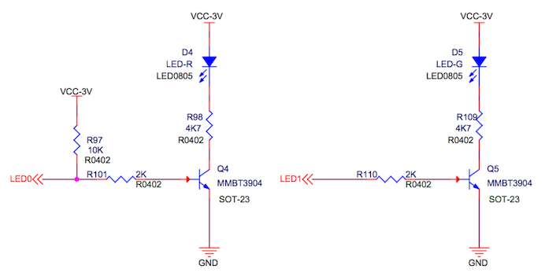
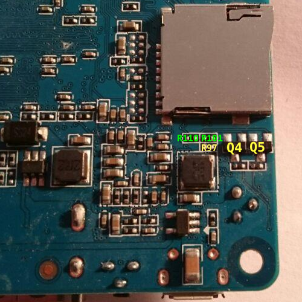
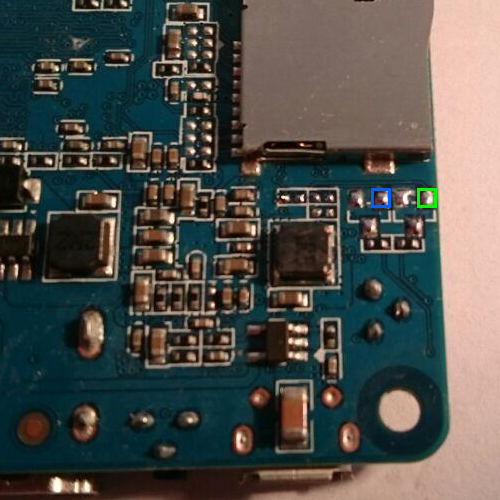
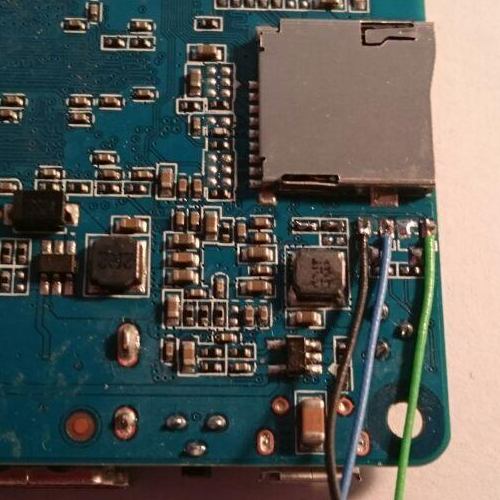

# CAN bus on Banana Pi M2 Berry

This repo includes some infos on making the CAN bus work on BPI M2 Berry.

## Overview

The BPI M2 Berry is based on the Allwinner V40 chip, which includes a CAN controller.
Unfortunately, the CAN pins are not exposed on the PCB, but used for connecting LEDs
and Ethernet instead.

In order to make the CAN bus work on BPI M2B, the following steps are required:

- Hardware modification
- Kernel patching
- Device tree overlay

## Hardware modification

The Allwinner V40 pinctl allows routing CAN pins to either PA16/PA17 or PH20/PH21.
By default, PA16/17 are used for ethernet, and PH20/21 for adressing the red and green LED.



In order to use PH20/21 for CAN, the driver transistors Q4 and Q5 need to be removed,
as well as resistors R97, R101 and R110.



R101 and R110 need to be replaced by solder bridges or 0402 zero-ohm links.



The CPU CAN pins can then be accessed through the transistor base pads:

 CAN_TX (PH20): Q4

 CAN_RX (PH21): Q5




## Kernel patching

The current version of Armbian Focal does not support CAN operation due to an incompatibilty
in the `sun4i_can` kernel module. A [patch](https://lore.kernel.org/linux-arm-kernel/20220111155709.56501-2-boger@wirenboard.com/)
has been submitted recently but hasn't made its way yet into the current version, so we need to
patch and rebuild the module manually.

```sh
cp -rv /usr/src/linux-source-5.10.60-sunxi kernel-source
cd kernel-source
patch -p1 < sun4i_can.patch
cp /boot/config-5.10.60-sunxi .config
cp /usr/src/linux-headers-5.10.60-sunxi/Module.symvers .
make oldconfig
make scripts prepare modules_prepare
make -C . M=drivers/net/can
sudo cp drivers/net/can/sun4i_can.ko /lib/modules/5.10.60-sunxi/kernel/net/can/
```
  
## Device tree overlay  

The provided overlay disables the LEDs and enables CAN on pins PH20 and PH21 instead.

```sh
armbian-add-overlay bananapi-m2-berry-can.dts
```
